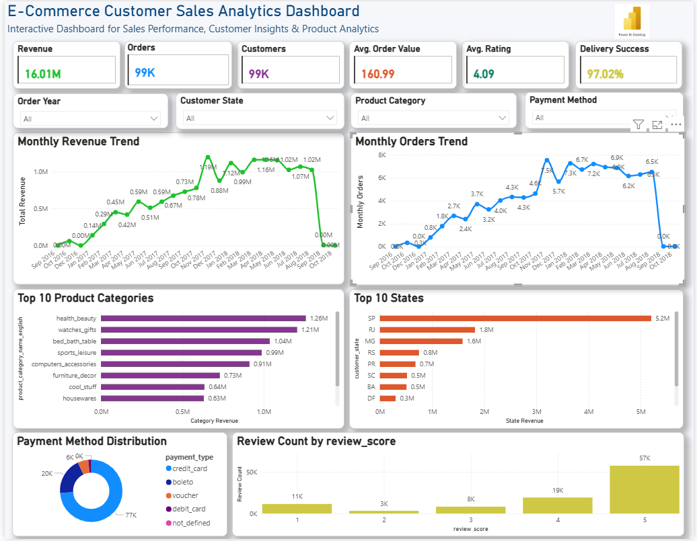

# 📊 E-Commerce Customer Sales Analytics Dashboard

## 📌 Project Overview

This project is an end-to-end Customer Sales Analytics solution built using Python, MySQL, SQL, and Power BI. It analyzes customer purchasing behavior, sales performance, payment trends, product performance, and customer reviews to generate actionable business insights through an interactive dashboard.

---

## 🚀 Features

- Data Cleaning and Preprocessing using Python (Pandas)
- Feature Engineering
- MySQL Database Design and Data Loading
- SQL Analysis for Business KPIs
- Interactive Power BI Dashboard
- Dynamic Filters (Slicers)
- DAX Measures
- Business Insights Visualization

---

## 🛠️ Tech Stack

- Python
- Pandas
- MySQL
- SQL
- Power BI
- DAX
- Matplotlib

---

## 📂 Dataset

The project uses the Brazilian E-Commerce Public Dataset (Olist), containing information about:

- Customers
- Orders
- Order Items
- Products
- Sellers
- Payments
- Reviews

---

## 📊 Dashboard Preview



---

## 📈 Dashboard KPIs

- Total Revenue
- Total Orders
- Total Customers
- Average Order Value
- Average Review Score
- Delivery Success Rate

---

## 📊 Visualizations

- Monthly Revenue Trend
- Monthly Orders Trend
- Top 10 Product Categories
- Top 10 States by Revenue
- Payment Method Distribution
- Review Score Distribution

---

## 🔍 Business Insights

- Identified the highest revenue-generating product categories.
- Analyzed monthly sales and order trends.
- Compared revenue across different customer states.
- Evaluated customer satisfaction using review scores.
- Analyzed customer payment preferences.
- Calculated key business KPIs using SQL and DAX.

---

## 📁 Project Structure

```text
Customer_Sales_Analytics/
│
├── cleaned_data/
├── dataset/
├── images/
│   ├── dashboard.png
│   ├── monthly_orders.png
│   ├── monthly_revenue.png
│   ├── payment_methods.png
│   ├── review_scores.png
│   └── top_categories.png
│
├── python/
│   ├── clean_data.py
│   ├── eda.py
│   ├── load_to_mysql.py
│   └── understand_data.py
│
├── sql/
│   ├── schema.sql
│   └── analysis.sql
│
├── powerbi/
│   ├── Customer_Sales_Analytics_Dashboard.pbix
│   ├── Customer_Sales_Analytics_Dashboard.pbit
│   └── Customer_Sales_Analytics_Dashboard.pdf
│
├── README.md
├── LICENSE
├── requirements.txt
└── .gitignore
```

---

## ▶️ How to Run

1. Clone the repository.

```bash
git clone https://github.com/Sirichaitra/E-Commerce-Customer-Sales-Analytics.git
```

2. Install dependencies.

```bash
pip install -r requirements.txt
```

3. Create the MySQL database using `schema.sql`.

4. Load the cleaned datasets using `load_to_mysql.py`.

5. Open `Customer_Sales_Analytics_Dashboard.pbix` in Power BI Desktop.

---

## 📌 Future Improvements

- Sales Forecasting
- Customer Segmentation
- Profit Analysis
- Interactive Drill-through Reports

---

## 👩‍💻 Author

**Siri Chaitra Tumpudi**

GitHub: https://github.com/Sirichaitra